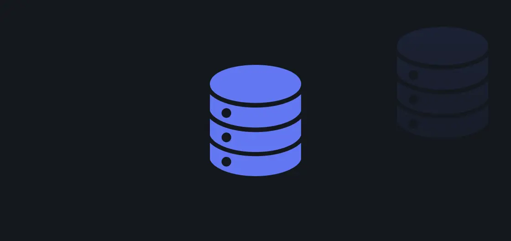
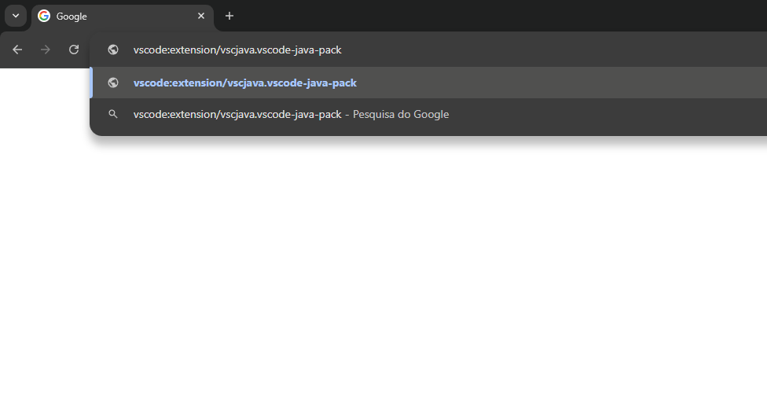
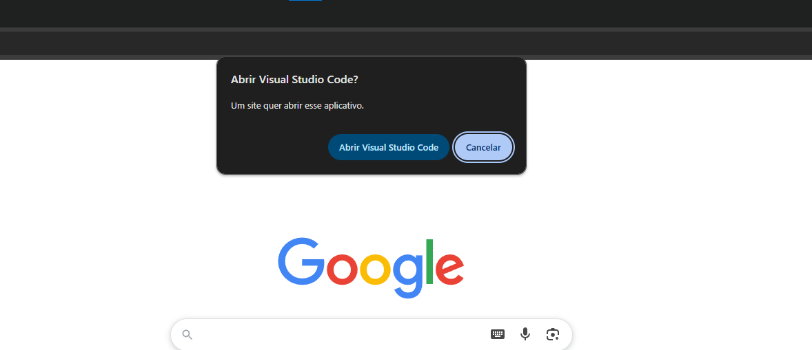
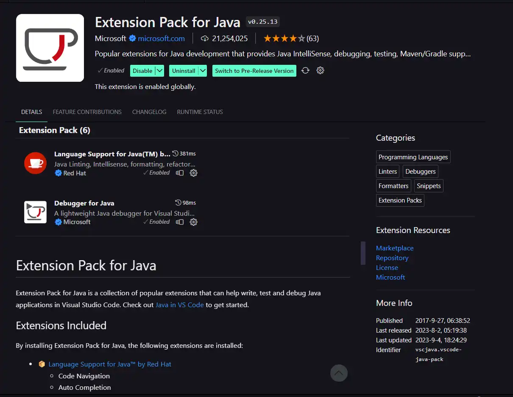
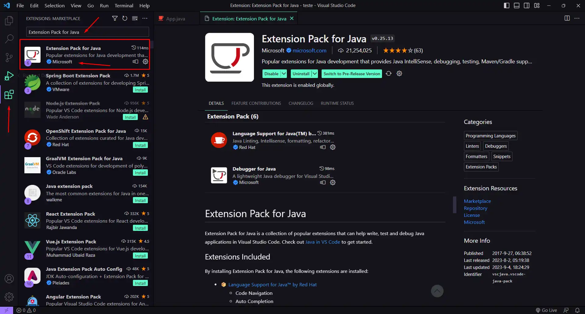

<!--
*** Obrigado por visitar este repositório de alterações no banco de dados da oBoticário! 💚
*** Este projeto foi desenvolvido com foco em melhorar a integridade, consistência
*** e escalabilidade dos dados da aplicação. Desde a adição de restrições importantes,
*** como UNIQUE e CHECK, até a normalização completa de tabelas, como Endereços e Vendas,
*** cada detalhe foi cuidadosamente ajustado para garantir um sistema robusto e confiável.
***
*** Se você tiver sugestões, dúvidas ou quiser contribuir, fique à vontade.
***
*** Obrigado novamente! Agora é hora de explorar um banco de dados mais limpo, seguro e eficiente! 🚀
-->

<!--LOGO -->

 

<h3 align="center">Banco de Dados oBoticario</h3>

  

     
  

<!-- Indice tabelas -->

  
Sumario

  <ol>
    <li>
      <a href="#sobre-o-projeto">Sobre o projeto</a>
    </li>
    <li>
      <a href="#inicio">Inicio</a>
    </li>
    <li>
      <a href="#uso">Uso</a>
    </li>
    <li>
      <a href="#historico-de-alterações">Historico de alterações</a>
    </li>
    <li>
      <a href="#integrantes">Integrantes</a>
    </li>
    <li>
      <a href="#licença">Licença</a>
    </li>
    <li>
      <a href="#contatos">Contatos</a>
    </li>
  </ol>

<!-- Sobre o projeto -->

## Sobre o projeto

<h6>O banco de dados oBoticário foi desenvolvido com o objetivo de estruturar de forma sólida e eficiente todas as informações envolvidas na operação do sistema de vendas, distribuição e gestão da rede oBoticário. Ele abrange diversas áreas do negócio, como gerenciamento de funcionários, revendedores, clientes, produtos, pedidos, vendas, pagamentos, ausências e férias.

Ao longo do projeto, foram aplicadas melhorias significativas em sua modelagem e estrutura, incluindo:

Aplicação de restrições de integridade como UNIQUE, CHECK e FOREIGN KEY para garantir consistência e autenticidade dos dados.

Criação e normalização de tabelas, como a separação de endereços em uma tabela única e a criação da tabela Itens_Venda para representar vendas detalhadas.

Adequação de tipos de dados, como padronização de campos CHAR para CPF, CNPJ e telefone, e inclusão de DATETIME com validações de datas passadas.

Implementação de validações de negócios no próprio banco, como preços positivos, datas válidas e status controlados via restrições.

Organização e mapeamento das tabelas em packages como Models, Repositories, Services e Controllers para integração com APIs e geração de relatórios.

Este banco foi projetado para ser escalável, seguro e fácil de manter, oferecendo uma base sólida para o funcionamento do sistema e para futuras integrações com serviços externos, APIs REST e ferramentas analíticas.

(<a href="#readme-top">Voltar ao topo</a>)

### Construido com

* [![Java][Java.dev]][Java-url]
* [![MySQL][MySQL.dev]][MySQL-url]
* [![Spring][Spring.dev]][Spring-url]
* [![Swagger][Swagger.dev]][Swagger-url]

(<a href="#readme-top">Voltar ao topo</a>)

<!-- Inicio -->
## Inicio

Se você quer rodar este projeto na sua máquina, não se preocupe o processo é simples! Abaixo você encontra um passo a passo claro para configurar tudo no seu ambiente local sem complicações.

### Pre-requisitos

💻 Sistema Operacional
- Windows 10 ou Windows 11

🛠️ Ferramentas de Desenvolvimento
- Visual Studio Code – Versão mais recente

  - Extensão: Java Extension Pack (fornece suporte completo ao desenvolvimento em Java)

- Java JDK – Versão compatível com o Spring Boot (recomenda-se JDK 17 ou superior)

- Spring Boot – Framework principal do projeto (última versão estável)

- MySQL – Sistema gerenciador de banco de dados relacional

  - Recomendado: MySQL Workbench para administração visual

- Swagger – Para documentação e testes da API REST

### Instalação

- Link de instalação do [Visual Studio Code](https://code.visualstudio.com)  
- Link de instalação do [Mysql](https://www.mysql.com) 
- Link de instalação do [SpringBoot](https://spring.io/projects/spring-boot) 
- Link de instalação do [Swagger](https://swagger.io) 

`Para instalar a extensão do java no Visual Studio Code, siga as instruções abaixo: `
1. Copie o link e insira o link no navegador : vscode:extension/vscjava.vscode-java-pack
  

2. Apos inserir o link clique na opção `Abrir Visual Studio Code`:
  

3. Em seguida irá abrir uma tela contendo as informações do pacote e em seguida é só clicar em install:
  

4. Ou também podem instalar direto pelo VS Code, clicando no ícone de extensões e digitando o nome da extensão desejada, que no nosso caso é a Extension Pack for java:
  

(<a href="#readme-top">Voltar ao topo</a>)

<!-- Uso -->
## Uso

Use this space to show useful examples of how a project can be used. Additional screenshots, code examples and demos work well in this space. You may also link to more resources.

_For more examples, please refer to the [Documentation](https://example.com)_

(<a href="#readme-top">Voltar ao topo</a>)

<!-- Historico de alterações -->
## Historico de alterações

Desde o início foram separados o que cada um iria fazer em todas as etapas, com foco em não sobrecarregar ninguém, tendo principal objetivo perceber quem é melhor em cada área e realizar tarefas de acordo com suas facilidades!

As primeiras ações realizadas foram:
- Separar para todos olhar o banco de dados procurando por mudanças e aquelas que eles acharam, iriam ser decididas quais as que realmente deveriam mudar, serem excluídas ou adicionadas.

- Todos terminando de verificar o banco de dados foram enviados para o Marzano(Líder) o que acharam de errado, juntando tudo foi separado pelo mesmo o que deveriam ser alterados, sendo encontrado também muitos erros diversos no banco de dados original, como tabela de endereços exageradas inutilmente (um dos erros mais significativos), falta de checks, validações, tipos de variáveis, após isso foram separados quem iria fazer tais mudanças.

- Líder deu suporte a todos, enquanto eles faziam e ia dando feedbacks do que faltava, para que conseguíssemos avançar juntos, enquanto isso foi criado um repositório adicionando todos os integrantes e criado branchs para o desenvolvimento separada da main. Para que pudéssemos ter controle do que estava em produção e do que já estava funcionando, todos nós trabalhávamos no Dev e quando cada um terminava a sua parte era realizado um um push para dev remota, um Action criava um PR automático pra main, onde o Líder iria revisar e aceitar ou não o Push dos Desenvolvedores.

- Após a mudança realizada no banco de dados foi iniciado o projeto e colocado no repositório já citado, com as regras e tudo mais, sendo orientado pelo Líder como deve ser feito todo o desenvolvimento.

- Foi separado como seria feito o projeto e quais extensões/linguagens iríamos usar, tais quais como seria configurado as pastas e tudo mais. Após tudo isso foi separado qual classe cada um deveria fazer, sendo realizada pelo Líder algumas classes iniciais e mostrado de exemplo como deveria ser feito as seguintes classes:

Endereços
Funcionários
Vendas
Itens_venda

- Foi separado a documentação no Swagger e tudo mais, configurado a conexão com o banco de dados e etc.

- Com o mapeamento das tabelas todo pronto agora precisávamos ter certeza de que estava completo e tudo certo então foram repassados as seguintes coisas para cada um fazer para que o mapeamento estivesse idêntico ao da query do banco de dados:

1. Testar todos os endpoints da API.
2. Ter certeza de que o hibernate crie as tabelas exatamente da mesma forma que a query que fizemos, isso inclui:  
 2.1. Colocar os tipos certos, big int, varchar. 
 2.2. Colocar os checks certos em tudo que precisar. 
 2.3. Char com tamanhos certos. cpf(13). 
 2.4. etc. 
3. Padronizar os nomes das variáveis.

- Enquanto eles faziam essas modificações Marzano(Líder), Arthur Alves e Gabriel ficamos para testar pelo Swagger os endpoints, para podermos adicionar remover, editar e buscar por id ou todos, estávamos testando a api a procura de erros ou melhorias, achamos alguns e corrigimos os que achamos, como por exemplo um funcionário poder ter só uma falta foram corrigidos.

- Depois que eles terminaram de fazer, foram separados novas tarefas para eles fazerem como melhorar a documentação do Swagger (descrição, títulos etc) quando todo mundo estava terminado tudo, todos se juntaram para testarmos tudo na API e corrigimos o que achamos de erros.

- Após a conclusão de todas as alterações no banco de dados e sua validação funcional, Gabriel será responsável por realizar a documentação completa das modificações realizadas, bem como pela inclusão do arquivo README no repositório do GitHub.

O arquivo contendo as alterações detalhadas do banco de dados está localizado nesse link: [Documento das alterações realizadas](https://docs.google.com/document/d/1GrrrW64qXNJJj2tchUmBkU3zxB8GjEuI30qanbMdsig/edit?tab=t.0).

(<a href="#readme-top">Voltar ao topo</a>)

<!-- INTEGRANTES -->
## Integrantes

Este projeto foi desenvolvido por um time dedicado e apaixonado por tecnologia. Cada integrante trouxe o seu conhecimento, experiência e criatividade, contribuindo de forma única em cada etapa do desenvolvimento.

- Arthur Araújo Marzano 

- Arthur Augusto Alves Araújo

- Bernardo Braga Gomes Carvalho

- Gabriel Arthur Ferreira De Jesus

- Isaac Adrian de Souza

- João Lucas da Costa bernardo

A colaboração entre as diferentes áreas foi essencial para transformar ideias em soluções funcionais. Sem o esforço coletivo, este projeto simplesmente não teria saído do papel. 

### Desenvolvedores:

(<a href="#readme-top">Voltar ao topo</a>)

<!-- LICENÇA -->
## Licença

Este projeto está licenciado sob os termos da Licença `MIT`.

A Licença `MIT` é uma licença de software permissiva que permite ampla reutilização do código, incluindo uso comercial, modificação, distribuição e sublicenciamento, desde que os devidos créditos aos autores originais sejam mantidos.

Essa escolha visa promover a colaboração, a reutilização do código e o desenvolvimento de soluções abertas e acessíveis.

Para mais informações, consulte o arquivo `LICENSE` incluído neste repositório.

(<a href="#readme-top">Voltar ao topo</a>)

<!-- CONTATOS -->
## Contatos

Gabriel Arthur - [@gbriel.js](https://www.instagram.com/gbriel.js/) - gbl48287@gmail.com

Arthur Araújo - [@marzan.0](https://www.instagram.com/marzan.0/) - arthuramarzano10@gmail.com

Arthur Augusto - [@arthur__alves06](https://www.instagram.com/arthur__alves06/)

Bernardo Braga - [@bragaxz9](https://www.instagram.com/bragaxz9/)

Isaac Adrian - [@isaac_souzzz](https://www.instagram.com/isaac_souzzz/)

João Lucas - [@joaolucasgym](https://www.instagram.com/joaolucasgym/)

Project Link: [https://github.com/Maarzano/oBoticario-db](https://github.com/Maarzano/oBoticario-db)

(<a href="#readme-top">Voltar ao topo</a>)

<!-- LINKS & IMAGENS -->
[contributors-shield]: https://img.shields.io/github/contributors/github_username/repo_name.svg?style=for-the-badge
[contributors-url]: https://github.com/github_username/repo_name/graphs/contributors
[forks-shield]: https://img.shields.io/github/forks/github_username/repo_name.svg?style=for-the-badge
[forks-url]: https://github.com/github_username/repo_name/network/members
[stars-shield]: https://img.shields.io/github/stars/github_username/repo_name.svg?style=for-the-badge
[stars-url]: https://github.com/github_username/repo_name/stargazers
[issues-shield]: https://img.shields.io/github/issues/github_username/repo_name.svg?style=for-the-badge
[issues-url]: https://github.com/github_username/repo_name/issues
[license-shield]: https://img.shields.io/github/license/github_username/repo_name.svg?style=for-the-badge
[license-url]: https://github.com/github_username/repo_name/blob/master/LICENSE.txt
[linkedin-shield]: https://img.shields.io/badge/-LinkedIn-black.svg?style=for-the-badge&logo=linkedin&colorB=555
[linkedin-url]: https://linkedin.com/in/linkedin_username
[product-screenshot]: images/screenshot.png

[Java.dev]: https://img.shields.io/badge/java-%23ED8B00.svg?style=for-the-badge&logo=openjdk&logoColor=white
[Java-url]: https://www.java.com/pt-BR/

[Swagger.dev]: https://img.shields.io/badge/-Swagger-%23Clojure?style=for-the-badge&logo=swagger&logoColor=white
[Swagger-url]: https://swagger.io/

[MySQL.dev]: https://img.shields.io/badge/mysql-4479A1.svg?style=for-the-badge&logo=mysql&logoColor=white
[MySQL-url]: https://www.mysql.com/

[Spring.dev]: https://img.shields.io/badge/spring-%236DB33F.svg?style=for-the-badge&logo=spring&logoColor=white
[Spring-url]: https://spring.io/projects/spring-boot